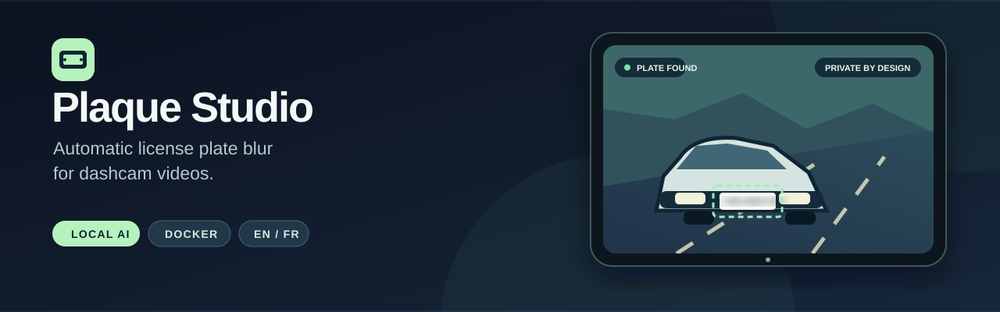

<p align="center">
  
</p>

# Plaque Studio

**Automatic license plate blurring for dashcam videos, right in your browser.** Drop in a video, track progress, preview the result beside the original, and download an H.264 MP4 with its audio preserved. Processing runs locally on your computer.

**English** · [Français](README.fr.md) &nbsp; | &nbsp; Docker Compose · Python · YOLOv8 · FFmpeg · MIT

## Start in one command

Install [Docker](https://docs.docker.com/get-docker/) with Compose, then run:

```bash
git clone https://github.com/Bouneh/dashcam-plate-blur-studio.git
cd dashcam-plate-blur-studio
docker compose up --build -d
```

Open **http://localhost:8001** and upload a video. On first start, Plaque Studio downloads the original model if `model/best.pt` is absent and verifies its SHA-256 hash. The model stays on your computer and is excluded from Git. The initial build and download need Internet access.

> **Review each export before publishing it.** Automatic detection can miss a plate or blur an unintended area.

## What you get

| | |
| --- | --- |
| **A simple web workflow** | Drag and drop a video, choose one of three blur strengths, and follow progress and the job queue. |
| **Preview before downloading** | Play the source and processed videos in the interface and compare them side by side. |
| **Video ready to share** | Export H.264 video with AAC audio when the source has an audio track. |
| **Private and local** | Uploads, results, and the model stay on your machine. Docker binds to `127.0.0.1` by default. |
| **English and French** | English is the default; switch to French in the top bar. Your choice is saved in the browser. |

The app accepts MP4, MOV, MKV, AVI, WebM, WMV, FLV and M4V, with a 4 GB upload limit by default. Only the model's **license plate** class is blurred; its face class is deliberately excluded.

## How it works

```text
Video upload → YOLOv8 plate detection → blur each detected plate → FFmpeg MP4 export → preview & download
```

Jobs run one at a time to avoid competing model loads. Additional videos wait in the queue. Uploads, exports and job history live in `web_data/jobs/` and remain available after a restart.

## Docker commands

Useful commands:

```bash
docker compose logs -f studio
docker compose down
```

The default host port is `8001`. To change it, set `STUDIO_PORT` in a local `.env` file (for example `STUDIO_PORT=8088`) and restart Compose. Docker publishes the port on `127.0.0.1` only. The default Docker setup runs inference on CPU. To use your own compatible model, place it at `model/best.pt` before starting.

If the upstream model download is unavailable, [download the model using the original project's instructions](https://github.com/varungupta31/dashcam_anonymizer) and place the file at `model/best.pt`. The UI will show a setup status until the model is present.

## Run without Docker

Use Python 3.10 or 3.11 and install both `ffmpeg` and `ffprobe` on your PATH.

```bash
python -m venv .venv-web
# Activate .venv-web (or invoke its Python executable directly).
python -m pip install -r requirements-web.txt -r requirements-model.txt
python model_setup.py
python web_server.py --port 8001
```

Open **http://127.0.0.1:8001**. Native inference uses CUDA if PyTorch detects it; otherwise it uses CPU.

## Configuration

| Setting | Default | Purpose |
| --- | --- | --- |
| `STUDIO_PORT` | `8001` | Host port for Docker Compose. |
| `DASHCAM_MAX_UPLOAD_GB` | `4` | Maximum uploaded video size in GB. |
| `DASHCAM_DATA_DIR` | `web_data/` | Job files and history. |
| `DASHCAM_MODEL_PATH` | `model/best.pt` | Path to a compatible YOLO model. |

The supplied model has two classes: `license` and `face`. Plaque Studio blurs only `license`. A custom model must have a class name containing `license`, `licence`, `plate` or `plaque`.

This is a local, single-user application without authentication; keep it bound to localhost. Uploaded videos, model weights, virtual environments and job data are ignored by Git.

## Development and legacy scripts

```bash
python -m unittest discover -s tests -v
node --test tests/test_i18n.js
node --check web/app.js
node --check web/i18n.js
```

The web application uses `web_server.py`, `web_processor.py` and the files in `web/`. The original batch workflows remain available through `blur_images.py` and `blur_videos.py` with their respective YAML files in `configs/`.

Contributions are welcome; see [CONTRIBUTING.md](CONTRIBUTING.md). Maintainers can use [PUBLISHING.md](PUBLISHING.md) for suggested GitHub metadata and first-publication steps.

## Credits and license

Plaque Studio adds a web workflow to [Varun Gupta's Dashcam Anonymizer](https://github.com/varungupta31/dashcam_anonymizer). The original scripts and attribution are preserved. The project uses the [MIT License](LICENSE). The model comes from the upstream project's Google Drive file and is verified against SHA-256 `c941613a63a2e54f1b4f4f1bc7dba3d2b42f905daf4513b3aeaed25b02a72236`.
